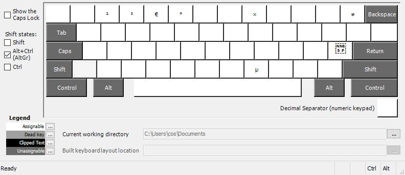
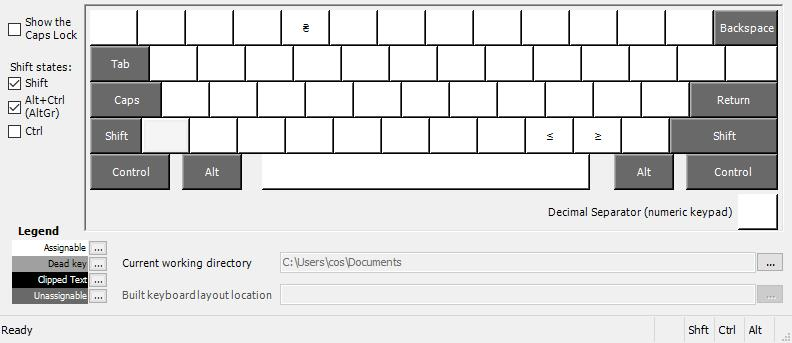

# US (with Unicode) keyboard layout

### Unicode symbols added:
* <code>²</code>&nbsp;`U+00B2` <kbd>Ctrl</kbd> + <kbd>Alt</kbd> + <kbd>2</kbd> [Superscript Two](https://www.compart.com/en/unicode/U+00B2)
* <code>³</code>&nbsp;`U+00B3` <kbd>Ctrl</kbd> + <kbd>Alt</kbd> + <kbd>3</kbd> [Superscript Three](https://www.compart.com/en/unicode/U+00B3)
* <code>€</code>&nbsp;`U+20AC` <kbd>Ctrl</kbd> + <kbd>Alt</kbd> + <kbd>4</kbd> [Euro Sign](https://www.compart.com/en/unicode/U+20AC), (Alt + 0128)
* <code>₴</code>&nbsp;`U+20B4` <kbd>Shift</kbd> + <kbd>Ctrl</kbd> + <kbd>Alt</kbd> + <kbd>4</kbd> [Hryvnia Sign](https://www.compart.com/en/unicode/U+20B4)
* <code>°</code>&nbsp;`U+00B0` <kbd>Ctrl</kbd> + <kbd>Alt</kbd> + <kbd>%</kbd> [Degree Sign](https://www.compart.com/en/unicode/U+00B0)
* <code>×</code>&nbsp;`U+00D7` <kbd>Ctrl</kbd> + <kbd>Alt</kbd> + <kbd>8</kbd> [Multiplication Sign](https://www.compart.com/en/unicode/U+00D7)
* <code>≠</code>&nbsp;`U+2260` <kbd>Ctrl</kbd> + <kbd>Alt</kbd> + <kbd>=</kbd> [Not Equal To](https://www.compart.com/en/unicode/U+2260)
* <code>μ</code>&nbsp;`U+03BC` <kbd>Ctrl</kbd> + <kbd>Alt</kbd> + <kbd>m</kbd> [Greek Small Letter Mu](https://www.compart.com/en/unicode/U+03BC) (as in microseconds)
* <code> </code>&nbsp;`U+202F` <kbd>Ctrl</kbd> + <kbd>Alt</kbd> + <kbd>'</kbd> [Narrow No-Break Space](https://www.compart.com/en/unicode/U+202F), used as [decimal separator](https://en.wikipedia.org/wiki/Decimal_separator#Unicode_characters) (e. g. 10 000 000)
* <code> </code>&nbsp;`U+00A0` <kbd>Shift</kbd> + <kbd>Space</kbd> [No-Break Space](https://www.compart.com/en/unicode/U+00A0)
* <code>≤</code>&nbsp;`U+2264` <kbd>Shift</kbd> + <kbd>Ctrl</kbd> + <kbd>Alt</kbd> + <kbd>&lt;</kbd> [Less-Than or Equal To](https://www.compart.com/en/unicode/U+2264)
* <code>≥</code>&nbsp;`U+2265` <kbd>Shift</kbd> + <kbd>Ctrl</kbd> + <kbd>Alt</kbd> + <kbd>&gt;</kbd> [Greater-Than or Equal To](https://www.compart.com/en/unicode/U+2265)

# Other

<kbd>Alt</kbd> + <kbd>Ctrl</kbd>  (or <kbd>R Alt</kbd>) 

<kbd>Shift</kbd> + <kbd>Alt</kbd> + <kbd>Ctrl</kbd> (or <kbd>Shift</kbd> + <kbd>R Alt</kbd>)  

# Installation
* Run `setup.exe` from the release archive
* Reboot

# TODO
* <code></code> [Diameter Sign](https://www.compart.com/en/unicode/U+2300)
* <code></code> [Word Joiner](https://www.compart.com/en/unicode/U+2060)
